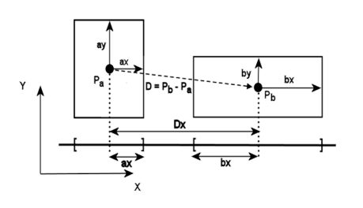
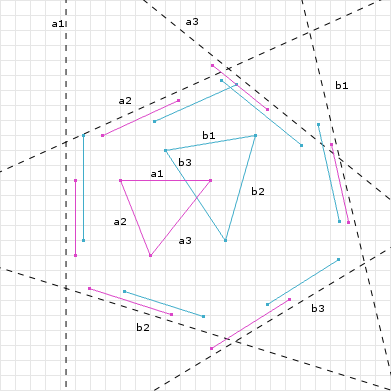

# CollisionShape

Used for adding collisions to an object

## How does it work

I've implemented two algorithms of collision detection

+ [AABB](#aabb)
+ [SAT](#sat) (actually used in the simulation)

## AABB


AABB stands for Axis-Aligned Bounding Box<br>
This method only works with rectangles or squares and only if they're axis-aligned
If all of these conditions are true, two object are colliding
```
other.left <= object.right
other.right >= object.left
other.top >= object.bottom
other.bottom <= object.top
```

## SAT

SAT (Separating Axis Theorem) algorithm is much better than AABB but also more expensive<br>
<br>
This algorithm works with every convex shape and every rotation



Basically, we make a projection of both shapes on every axis.<br>
If all of the projections overlap, the objects are colliding. 