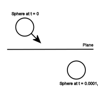
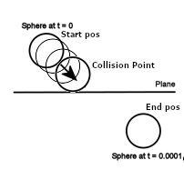
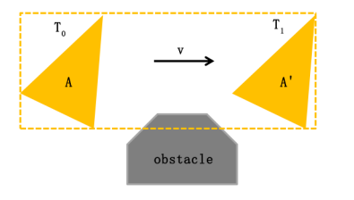

# RigidBody

Used for adding physics to objects

## Functions

- [Collision Detection](#collision-detection)
- [Velocity](#velocity)

## Collision Detection

Used to check if an object is colliding with another object
<br><br>
Types of collision detection

### Discrete

Discrete collision detection simply uses aabb/sat algorithm and detects if there is a collision on the position where the object wants to go
<br><br>
#### Pros:
+ Low computational cost
#### Cons:
- Tunneling <br>

#### What's tunneling?

<br>
Tunneling is when an object moves so fast that from one frame to another, he completely passes another object

#### Solutions for tunneling

- Make sure an object doesn't move too fast
- Increase frames per second
- Continuous collision detection
- Swept volume

### Continuous


Continuous collision detection checks every position between start and end position, so that the computer knows the exact position where two object are colliding.


#### Pros:
+ Precise collision detection
#### Cons:
- Higher computation cost than Discrete one

### Swept volume

Note: this method is not implemented in the simulation
<br><br>
Swept volume is the volume of the object from one frame to the next.



## Velocity

Velocity is used to calculate the next position of an object
<br>
The position is updated following the law of motion
<br><br>
s(t) = s0 + v0 * time + 0.5 * velocity * time
<br><br>
where:
+ s0 = start position
+ v0 = start velocity
+ time = deltaTime (The interval in seconds from the last frame to the current one)

**Note:** velocity can be assigned from its variable or can be updated using the `addForce()` [function](#addforce)

### addForce

Definition:
```c++
void addForce(sf::Vector2f force, ForceMode mode);
```

The addForce function updates the `velocity` variable based on the ForceMode given
<br>
Force modes:
+ [Force](#force)
+ [Acceleration](#acceleration)
+ [Impulse](#impulse)

#### Force
Given the Force (In Newton or Kg*m/s^2)<br>
Since<br>
a = F/m<br>
We have that<br>
v = (a * deltaTime) / mass

#### Acceleration
Given the acceleration (In m/s^2)<br>
v = a * deltaTime

#### Impulse
Given the impulse `F` (Momentum change => Kg*m/s)<br>
v = F / mass

### Gravity

Gravity is applied by subtracting<br>
```c++
namespace PhysicsLaws
{
    const float GravityAcceleration = -9.81f; // m/s^2
}

sf::Vector2f(0, PhysicsLaws::GravityAcceleration * deltaTime)
```
to the `velocity` variable